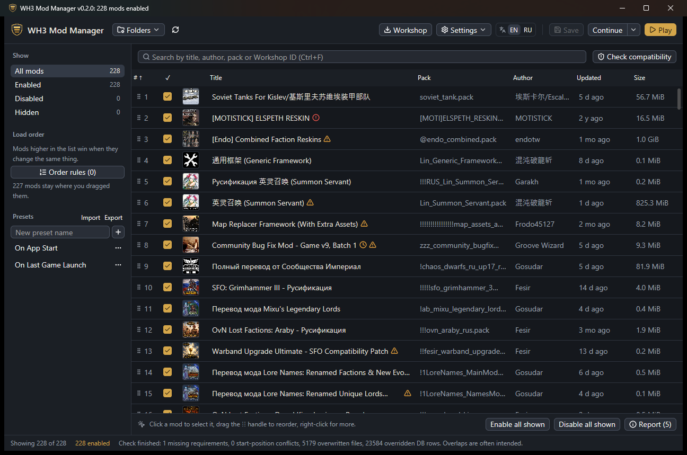

  

<h1 align="center">WH3 Mod Manager</h1>

  <b>English</b> | <a href="README_RUS.md">Русский</a>

  Tick your mods. Drag them into order. Press <b>Play</b>. 
  A fast, native mod manager for <b>Total War: WARHAMMER III</b> on Steam.

  
  
  
  

  <a href="https://github.com/Mnwa/WH3-Mod-Manager/releases/latest"><b>Download for Windows</b></a>
   choose the <b>WH3-Mod-Manager-v0.3.0-windows-x64.zip</b> asset

A native Windows rewrite of [Shazbot's WH3 Mod Manager](https://github.com/Shazbot/WH3-Mod-Manager):
the same everyday features without Electron, and it imports everything you set up in
the original. It speaks English and Russian and picks your system language on first start.

## Start playing in three steps

1. **Download** `WH3-Mod-Manager-…-windows-x64.zip` from the
   [latest release](https://github.com/Mnwa/WH3-Mod-Manager/releases/latest), unpack the
   whole archive into any folder and run `wh3-mod-manager.exe`.
2. **Tick the mods you want** and drag them by the `⋮⋮` handle into order. A mod higher
   in the list wins when two mods change the same thing.
3. **Press Play.** Your list is saved and the game starts with it. Next time,
   **Continue** loads your newest campaign save directly.

The manager finds the game in your Steam libraries on its own. If it can't, it asks you
for the folder that contains `Warhammer3.exe`.

> [!NOTE]
> Windows may say "Windows protected your PC" because the program is not signed. Click
> **More info → Run anyway**. You need 64-bit Windows 10 or 11 and Steam with the game;
> nothing else has to be installed. Keep `steam_api64.dll` next to the executable:
> Workshop features need it.

> [!TIP]
> **Coming from the original manager?** Open **Settings → Import its config.json or a
> metadata file…** and pick `%APPDATA%\wh3mm\config.json`. Enabled mods, load order,
> presets, categories, rules, hidden and always-enabled mods and start options come
> over; the original file is never changed.

## What it does that the CA launcher doesn't

| | CA launcher | WH3 Mod Manager |
|---|:-:|:-:|
| Stays instant with hundreds or thousands of mods, with thumbnails, authors and dates | — | ✓ |
| Drag-and-drop load order, "load before / after" rules, pinned positions | — | ✓ |
| Presets: switch between whole mod lists in one click | — | ✓ |
| Compatibility check: who overwrites whose files and database rows, missing requirements, clashing campaign starts | — | ✓ |
| Update, subscribe, unsubscribe and import Steam collections without leaving the app | — | ✓ |
| **Continue** your latest campaign, or enable exactly the mods a save used | — | ✓ |
| Skip intro movies, script logs, instant custom battle, units as generals | — | ✓ |
| Search by title, author, pack or Workshop ID, including `/regex/` | — | ✓ |
| Notices new, updated and removed mods and new saves without a rescan | — | ✓ |
| Share your list as text with friends (works with the original manager too) | — | ✓ |
| Finds the mod that breaks your game by testing half of them at a time | — | ✓ |
| Two lists side by side, category groups, row size and resizable columns | — | ✓ |
| Copies or links mods into the game folder for modders, raises the game's priority | — | ✓ |
| Updates itself from GitHub Releases | — | ✓ |

## Finding your way around

Controls are labeled in words, and hovering a button explains what it does. A few
things worth knowing:

- **The bar under the list changes with what you do.** With nothing selected it shows
  how the list works and offers *Enable / Disable all shown*. Click a mod and it shows
  that mod's actions: move it, open its Workshop page, see the files inside.
- **Sorting never changes the load order.** Click a column title to sort the table; a
  notice appears with a *Show load order* button to go back. Dragging works only in
  load-order view.
- **Right-click a mod** for everything else: *Load before… / Load after…*, keep always
  enabled, hide, categories, update from the Workshop, unsubscribe, show in folder.
- **Several mods at once:** `Ctrl+click`, `Shift+click` or `Ctrl+A`, then `Space` or
  right-click.
- **Unsaved changes** are marked in the status bar. **Play** saves for you; `Ctrl+S`
  saves without playing.
- **No need to rescan.** When Steam downloads, updates or removes a mod, the list
  catches up by itself a moment later, and new campaign saves appear under
  **Continue ▾**.
- **The game is already running?** Play turns into *Game is running*. Click it to
  restart the game with your current list as soon as you quit; the **×** next to it
  closes the game.

### Make it yours

Open **View** next to the search box:

- **Two lists** puts mods that are not enabled on the left and enabled mods, in load
  order, on the right. Tick a mod on the left (or drag it across) to enable it; drag
  on the right to reorder.
- **Group by category** shows each category as a group you can collapse, with an
  *Enable all* / *Disable all* button per group.
- **Row size** switches between compact, comfortable and roomy rows.
- Drag the edge of a column title to resize it; double-click the edge to reset.

Your choice is remembered between sessions.

### For modders and power users

- **Settings → Workshop mods at launch** can copy or link your enabled Workshop mods
  into the game folder (`whmm_copied_mods`) before each launch, as the original
  manager does, and delete them again when the game closes.
- **Folders → Game data folder** copies or links enabled mods into the game's `data`
  folder and removes them again. It never overwrites a file and asks before deleting.
  Right-click a mod for the same actions on just that mod. Links need administrator
  rights or Windows Developer Mode.
- **Settings → Raise the game's priority** sets the game to high priority once it
  starts, which can help when you alt-tab.

### Badges next to a title

| Badge | Means | What to do |
|---|---|---|
| Lock | Always enabled, even when a preset says otherwise | Right-click → *Keep always enabled* to release it |
| Film | Movie pack: the game loads it with high priority | Usually nothing |
| Clock | Older than the last game update and overwrites game files | Check the mod's page for an update |
| Down arrow | A newer version is on the Workshop | Right-click → *Update from Workshop*, or **Workshop → Update outdated mods** |
| Triangle | Overwrites or is overwritten by another mod (after a check) | Often intended; see the report |
| Red circle | Needs a mod that is disabled or not installed | **Get required mods** in the report |
| Layers | A copy with the same name is in the game's `data` folder and is loaded instead | Remove the copy in `data` to use this one |

### Keyboard

| Keys | Action |
|---|---|
| `Ctrl+F` | Search |
| `Space` | Enable or disable the selected mods |
| `Alt+↑` / `Alt+↓` | Move the selected mod up or down |
| `Alt+Home` / `Alt+End` | Move it to the top or the bottom |
| `Ctrl+A` | Select every shown mod |
| `Ctrl+S` | Save |
| `Esc` | Close the report |

## Questions

<b>Does it touch my game files?</b>

It writes its own mod list, `wh3_rust_mods.txt`, into the game folder, so it never
overwrites the original manager's `used_mods.txt`. Files generated for the start options
live in the manager's data folder. Anything else in the game folder happens only when
you ask for it: copies or links in `data`, and the `whmm_copied_mods` folder of
Workshop staging. Existing files are never overwritten, and nothing is deleted without
your confirmation (or, for staging, your "delete when the game closes" choice).

<b>Where are my mod list and presets stored?</b>

In `%APPDATA%\wh3-mod-manager-rust`. Every save keeps the previous version as
`library.whmm.bak`. To keep everything in another folder, for example a portable copy,
set the `WH3MM_HOME` environment variable to that folder.

<b>How do I play multiplayer with friends?</b>

Enable the same mods in the same order and use the same options under
**Settings → When the game starts**. Click **Presets → Share → Copy my list** and send
the text. Your friend pastes it under **Share → Use a friend’s list**: missing Workshop
mods are subscribed and the same list is enabled in the same order. The text works in
the original WH3 Mod Manager too.

<b>The game crashes or misbehaves. Which mod is it?</b>

Open **Settings → Find the mod that causes a problem…**. The manager switches off half of
your mods; play, then answer *Problem is still there* or *Problem is gone*. After a few
rounds it names the mod. A tested mod always runs with the mods it requires, and only
mods that require each other are named together. Your list is saved under
*Saved automatically → Before problem search* and restored at the end, with the culprit or without it and the
mods that require it.

<b>A Workshop mod is broken and Update does not help</b>

Right-click it → **Reinstall from Workshop…**. Steam deletes the files and downloads
them again; if the mod was enabled, it is enabled again.

<b>How do I change the language?</b>

Use the **EN | RU** switch in the top bar. On first start the manager follows your
Windows display language.

<b>How do I update the manager?</b>

When a new version is out, a green **Update** button appears in the top bar. Click it,
then **Restart**; your mod list is saved first.

<b>What is not ported from the original yet?</b>

The mod-management part is ported. The pack/DB editors, game data viewers and node
flows are not. [MIGRATION.md](docs/MIGRATION.md) lists what is ported and what still
differs.

## Help and development

Found a problem? [Open an issue](https://github.com/Mnwa/WH3-Mod-Manager/issues).
Developers: see [DEVELOPMENT.md](DEVELOPMENT.md).

## License

MIT. Based on the original WH3 Mod Manager by Shazbot. The bundled DB schema derives
from [RPFM's schemas](https://github.com/Frodo45127/rpfm-schemas) (MIT); see
[crates/core/assets/NOTICE](crates/core/assets/NOTICE).
