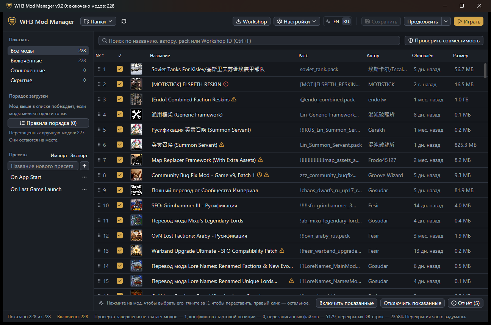

  

<h1 align="center">WH3 Mod Manager</h1>

  <a href="README.md">English</a> | <b>Русский</b>

  Отметьте моды. Перетащите их в нужном порядке. Нажмите <b>«Играть»</b>. 
  Быстрый нативный менеджер модов для <b>Total War: WARHAMMER III</b> в Steam.

  
  
  
  

  <a href="https://github.com/Mnwa/WH3-Mod-Manager/releases/latest"><b>Скачать для Windows</b></a>

Нативная Windows-версия [WH3 Mod Manager от Shazbot](https://github.com/Shazbot/WH3-Mod-Manager):
те же повседневные возможности, но без Electron, и всё, что вы настроили в оригинале,
переносится импортом. Интерфейс на русском и английском; при первом запуске выбирается
язык системы.

## Три шага до игры

1. **Скачайте** `WH3-Mod-Manager-…-windows-x64.zip` из
   [последнего релиза](https://github.com/Mnwa/WH3-Mod-Manager/releases/latest),
   распакуйте архив целиком в любую папку и запустите `wh3-mod-manager.exe`.
2. **Отметьте нужные моды** и перетащите их за значок `⋮⋮` в нужном порядке. Если два
   мода меняют одно и то же, побеждает тот, что выше в списке.
3. **Нажмите «Играть».** Список сохранится, и игра запустится с ним. В следующий раз
   **«Продолжить»** сразу загрузит последнее сохранение кампании.

Менеджер сам находит игру в библиотеках Steam. Если не получилось, он попросит указать
папку, в которой лежит `Warhammer3.exe`.

> [!NOTE]
> Windows может показать «Система Windows защитила ваш компьютер», потому что программа
> не подписана. Нажмите **Подробнее → Выполнить в любом случае**. Нужны только 64-битная
> Windows 10 или 11 и Steam с игрой; больше ничего устанавливать не надо. Держите
> `steam_api64.dll` рядом с исполняемым файлом: он нужен для функций Workshop.

> [!TIP]
> **Переходите с оригинального менеджера?** Откройте **Настройки → Импортировать его
> config.json или файл метаданных…** и выберите `%APPDATA%\wh3mm\config.json`.
> Перенесутся включённые моды, порядок загрузки, пресеты, категории, правила, скрытые и
> всегда включённые моды и параметры запуска; исходный файл не изменяется.

## Чего нет в лаунчере CA

| | Лаунчер CA | WH3 Mod Manager |
|---|:-:|:-:|
| Мгновенная работа с сотнями и тысячами модов, с превью, авторами и датами | — | ✓ |
| Порядок загрузки перетаскиванием, правила «загружать перед / после», закреплённые позиции | — | ✓ |
| Пресеты: переключение между целыми наборами модов в один клик | — | ✓ |
| Проверка совместимости: кто чьи файлы и строки базы данных перекрывает, недостающие моды, конфликты старта кампании | — | ✓ |
| Обновление, подписка, отписка и импорт коллекций Steam прямо из приложения | — | ✓ |
| **«Продолжить»** последнюю кампанию или включить ровно те моды, что были в сохранении | — | ✓ |
| Пропуск заставок, логи скриптов, мгновенная своя битва, юниты как генералы | — | ✓ |
| Поиск по названию, автору, pack или Workshop ID, в том числе `/regex/` | — | ✓ |
| Замечает новые, обновлённые и удалённые моды и новые сохранения без пересканирования | — | ✓ |
| Делиться списком модов с друзьями в виде текста (работает и с оригинальным менеджером) | — | ✓ |
| Находит мод, ломающий игру, проверяя моды по половинам | — | ✓ |
| Два списка рядом, группы по категориям, размер строк и изменяемые столбцы | — | ✓ |
| Копирует моды и создаёт ссылки в папке игры для мододелов, повышает приоритет игры | — | ✓ |
| Самообновление из GitHub Releases | — | ✓ |

## Как здесь всё устроено

Кнопки подписаны словами, а при наведении каждая объясняет, что делает. Несколько вещей,
которые полезно знать:

- **Панель под списком меняется вместе с вашими действиями.** Когда ничего не выбрано,
  она подсказывает, как работать со списком, и предлагает *Включить / Отключить
  показанные*. Нажмите на мод — и там появятся его действия: сдвинуть, открыть страницу
  в Workshop, посмотреть файлы внутри.
- **Сортировка не меняет порядок загрузки.** Нажмите на заголовок столбца, чтобы
  отсортировать таблицу; появится уведомление с кнопкой *Показать порядок загрузки*.
  Перетаскивать моды можно только в режиме порядка загрузки.
- **Правый клик по моду** — всё остальное: *Загружать перед… / после…*, всегда включён,
  скрыть, категории, обновить из Workshop, отписаться, показать в папке.
- **Несколько модов сразу:** `Ctrl+клик`, `Shift+клик` или `Ctrl+A`, затем `Пробел` или
  правый клик.
- **Несохранённые изменения** отмечаются в строке состояния. **«Играть»** сохраняет
  сама; `Ctrl+S` сохраняет без запуска.
- **Пересканировать не нужно.** Когда Steam скачивает, обновляет или удаляет мод,
  список сам подстраивается через мгновение, а новые сохранения кампании появляются в
  **«Продолжить ▾»**.
- **Игра уже запущена?** Кнопка «Играть» превращается в *«Игра запущена»*. Нажмите её —
  и игра перезапустится с текущим списком, как только вы из неё выйдете; **×** рядом
  закрывает игру.

### Настройте под себя

Откройте **«Вид»** рядом с поиском:

- **Два списка**: слева не включённые моды, справа включённые — в порядке загрузки.
  Отметьте мод слева (или перетащите его вправо), чтобы включить; справа
  перетаскивайте, чтобы поменять порядок.
- **Группировать по категориям**: каждая категория — сворачиваемая группа с кнопкой
  *«Включить все» / «Отключить все»*.
- **Размер строк**: компактный, обычный или крупный.
- Потяните за край заголовка столбца, чтобы изменить ширину; двойной клик по краю
  сбрасывает её.

Выбор запоминается между запусками.

### Для мододелов и опытных пользователей

- **Настройки → Моды Workshop при запуске** могут перед каждым запуском копировать
  включённые моды Workshop в папку игры (`whmm_copied_mods`) или создавать на них
  ссылки, как в оригинальном менеджере, и удалять их после закрытия игры.
- **Папки → Папка data игры** копирует включённые моды в папку `data` игры или создаёт
  там ссылки и умеет их удалять. Файлы никогда не перезаписываются, перед удалением
  менеджер спрашивает. Те же действия для одного мода — в меню по правому клику.
  Для ссылок нужны права администратора или режим разработчика Windows.
- **Настройки → Повышать приоритет игры** выставляет игре высокий приоритет после
  запуска — это может помочь при переключении через Alt+Tab.

### Значки рядом с названием

| Значок | Что значит | Что делать |
|---|---|---|
| Замок | Всегда включён, даже если пресет говорит иначе | Правый клик → *Всегда включён*, чтобы снять |
| Плёнка | Movie pack: игра загружает его с высоким приоритетом | Обычно ничего |
| Часы | Старше последнего обновления игры и перезаписывает её файлы | Проверьте, нет ли обновления на странице мода |
| Стрелка вниз | В Workshop есть новая версия | Правый клик → *Обновить из Workshop* или **Workshop → Обновить устаревшие моды** |
| Треугольник | Перекрывает другой мод или перекрыт им (после проверки) | Часто так и задумано; см. отчёт |
| Красный круг | Нужен мод, который отключён или не установлен | **Установить нужные моды** в отчёте |
| Слои | Копия с тем же именем есть в папке `data` игры и загружается вместо этого мода | Удалите копию из `data`, чтобы использовать этот мод |

### Клавиатура

| Клавиши | Действие |
|---|---|
| `Ctrl+F` | Поиск |
| `Пробел` | Включить или отключить выбранные моды |
| `Alt+↑` / `Alt+↓` | Сдвинуть выбранный мод выше или ниже |
| `Alt+Home` / `Alt+End` | В начало или в конец |
| `Ctrl+A` | Выбрать все показанные моды |
| `Ctrl+S` | Сохранить |
| `Esc` | Закрыть отчёт |

## Вопросы

<b>Менеджер трогает файлы игры?</b>

Он записывает в папку игры собственный список модов, `wh3_rust_mods.txt`, поэтому
никогда не перезаписывает `used_mods.txt` оригинального менеджера. Файлы для параметров
запуска хранятся в папке данных менеджера. Всё остальное в папке игры происходит только
по вашей команде: копии и ссылки в `data` и папка `whmm_copied_mods` для модов
Workshop. Существующие файлы не перезаписываются, и ничего не удаляется без вашего
подтверждения (для `whmm_copied_mods` — без включённой опции «удалять после закрытия
игры»).

<b>Где хранятся список модов и пресеты?</b>

В `%APPDATA%\wh3-mod-manager-rust`. При каждом сохранении предыдущая версия остаётся в
`library.whmm.bak`. Чтобы хранить всё в другой папке, например для портативной копии,
укажите её в переменной окружения `WH3MM_HOME`.

<b>Как играть с друзьями в мультиплеере?</b>

Включите одинаковые моды в одинаковом порядке и одинаковые параметры в
**Настройки → При запуске игры**. Нажмите **Пресеты → Поделиться → Скопировать мой
список** и отправьте текст. Друг вставит его в **Поделиться → Взять список друга**:
недостающие моды из Workshop будут подписаны, и включится тот же список в том же
порядке. Текст подходит и для оригинального WH3 Mod Manager.

<b>Игра вылетает или ведёт себя странно. Какой мод виноват?</b>

Откройте **Настройки → Найти мод, который вызывает проблему…**. Менеджер отключит
половину модов; сыграйте и ответьте *«Проблема осталась»* или *«Проблемы нет»*. Через
несколько раундов он назовёт мод (моды, которые требуют друг друга, проверяются
вместе). Ваш список сохраняется как пресет «Before problem search» и в конце
возвращается — с виновником или без него.

<b>Мод из Workshop сломан, и обновление не помогает</b>

Правый клик по нему → **Переустановить из Workshop…**. Steam удалит файлы и скачает их
заново; если мод был включён, он снова включится.

<b>Как сменить язык?</b>

Переключателем **EN | RU** в верхней панели. При первом запуске менеджер выбирает язык
интерфейса Windows.

<b>Как обновить менеджер?</b>

Когда выходит новая версия, в верхней панели появляется зелёная кнопка **«Обновить»**.
Нажмите её, затем **«Перезапустить»**; список модов сначала сохранится.

<b>Что ещё не перенесено из оригинала?</b>

Управление модами перенесено полностью. Редакторы pack и DB, просмотр игровых данных и
node flows — нет. В [MIGRATION.md](docs/MIGRATION.md) (на английском) перечислено, что
перенесено и чем версия пока отличается.

## Помощь и разработка

Нашли проблему? [Создайте issue](https://github.com/Mnwa/WH3-Mod-Manager/issues).
Для разработчиков: [DEVELOPMENT.md](DEVELOPMENT.md) (на английском).

## Лицензия

MIT. Основано на оригинальном WH3 Mod Manager от Shazbot. Встроенная схема DB основана
на [схемах RPFM](https://github.com/Frodo45127/rpfm-schemas) (MIT); см.
[crates/core/assets/NOTICE](crates/core/assets/NOTICE).
